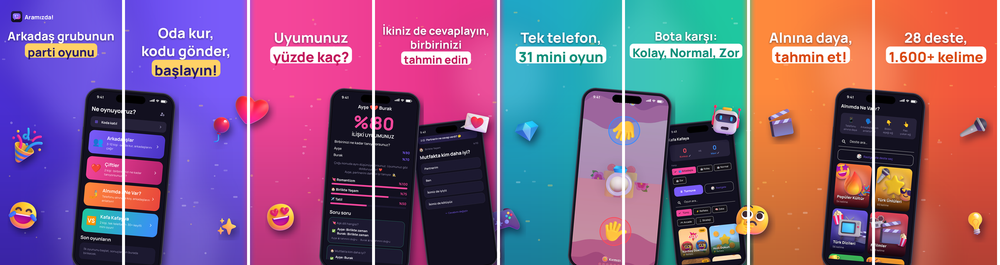
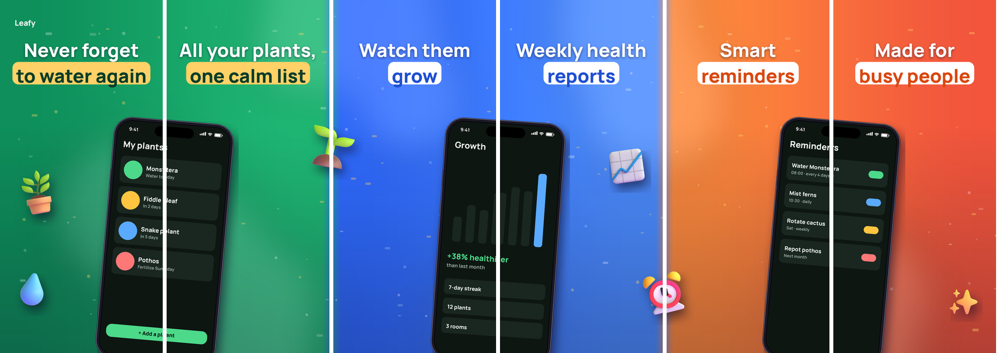

# appstore-panorama

**Designer-grade, seamless panoramic App Store & Google Play screenshots — generated from your real app screens by Claude.**

Phones sit on the border between two screenshots, 3D stickers cross from one scene into the next, and every screenshot still works on its own. Swipe through the store listing and it reads as one continuous picture — the look top apps pay designers for.


<sub>Real production set for the Aramızda app (8 screenshots, one canvas). Below: the bundled demo.</sub>



## What's inside

| | |
|---|---|
| `panorama/` | Python renderer: JSON config → sliced store screenshots in every Apple size |
| `.claude/agents/appstore-panorama.md` | A Claude Code **sub-agent** that does the whole job: analyse the app, capture real screens, write headlines, render, review, iterate |
| `.claude/skills/appstore-panorama/SKILL.md` | The design playbook the agent follows (layout rules, copy rules, visual QA checklist) |
| `capture/` | Real-screen capture: iOS Simulator, Android emulator, Flutter widget-test harness |
| `examples/` | `demo/` (runs offline-ish, fictional plant app) and `aramizda/` (a real 8-image set) |

**Built-in validator** — after every build it reports headlines that don't fit, phones or stickers that overlap a headline, screenshots without a headline, and stickers upscaled so far they'll look soft.

## Quick start

```bash
git clone https://github.com/<you>/appstore-panorama && cd appstore-panorama
pip install -r requirements.txt            # just Pillow
python examples/demo/make_screens.py       # placeholder screens for the demo
python -m panorama build examples/demo/panorama.json
open examples/demo/out/_preview_panels.png # or look in examples/demo/out/iphone-6.9/
```

Your own app:

```bash
python -m panorama init my-app/panorama.json   # starter config
# put real captures in my-app/screens/ (see "Capturing real screens")
python -m panorama build my-app/panorama.json
```

## Use it with Claude Code (recommended)

Copy the `.claude/` folder into your app's repository (or into `~/.claude/` to have it everywhere) and keep this repo somewhere on disk. Then just ask:

> *"Make App Store screenshots for this app with the appstore-panorama agent."*

The agent analyses your app, captures real screens, writes the headlines in your listing's language, renders the set, **looks at every screenshot**, fixes what's wrong and tells you the upload order.

## Config reference (`panorama.json`)

Coordinates: **`x` is in panel units** (`0.5` = centre of screenshot 1, `1.0` = the border between 1 and 2), `y` in pixels of the design height (2868).

```jsonc
{
  "canvas": { "panels": 8, "panel_width": 1320, "panel_height": 2868, "seed": 7 },
  "output": { "sizes": ["iphone-6.9", "iphone-6.5"] },        // see: python -m panorama sizes
  "background": {
    "transition_px": 70,                                       // colour changes ONLY at scene borders
    "scenes": [ { "panels": [0, 1], "colors": ["#4B2FD6", "#7A5CFA"] } ],
    "glow": true, "confetti": true
  },
  "brand": { "x": 0.09, "y": 120, "icon": "icon.png", "name": "My App" },
  "headlines": [
    { "panel": 0, "lines": ["Never forget", "to water again"], "pill_line": 1,
      "pill_color": "#FFD166", "pill_text": "#0B3D2A", "y": 300, "size": 152 }
  ],
  "phones": [
    { "screen": "screens/01.png", "x": 1.0, "y": 1960, "width": 880, "angle": -5,
      "status_bar": "draw", "z": 10 }                          // "none" if the capture has one
  ],
  "stickers": [
    { "emoji": "Party popper", "x": 2.0, "y": 1200, "size": 380, "angle": -12 },  // Fluent 3D name
    { "image": "art/mascot.png", "x": 0.2, "y": 2300, "size": 300 }               // or your own PNG
  ]
}
```

Sticker names are folder names from [microsoft/fluentui-emoji](https://github.com/microsoft/fluentui-emoji/tree/main/assets) ("Red heart", "Video game", "Thinking face" …). They download once and are cached.

Sizes: `iphone-6.9` 1320×2868 · `iphone-6.7` 1290×2796 · `iphone-6.5` 1284×2778 · `iphone-5.5` 1242×2208 · `android-phone` 1080×2340.

## Capturing real screens

App Store guideline 2.3.3: screenshots must show the app in use. Don't fake screens.

- **iOS Simulator** — `capture/ios_simulator.sh screens/01.png` (forces a clean 9:41 status bar). Set `"status_bar": "none"` for that phone.
- **Android** — `capture/android_emulator.sh screens/01.png` (System UI demo mode).
- **Flutter, no device** — `capture/flutter_store_shots_test.dart` renders your real widgets at 1170×2532. Its header lists the five pitfalls that silently ruin store images (fonts, □ icons, emoji tofu, background images not loaded, widgets that call your backend) and how the template handles them.

## Design rules that make it look designed

1. Scenes of two screenshots, one colour each; colour changes only at scene borders.
2. A phone on the border inside each scene; a 3D sticker exactly on every scene border.
3. Headlines in the top 30%: 2–3 short lines, one punchline in a pill. Benefit, not feature.
4. The first three screenshots must sell the app alone — they're what search results show.
5. Upload `01.png → NN.png` in order, or the panorama breaks.
6. Always review each screenshot alone (`_preview_panels.png`), not just the panorama.

## Tests

```bash
python -m unittest discover tests      # offline
```

## Licences

Code: MIT (see `LICENSE`). Manrope font: SIL OFL 1.1. Fluent Emoji 3D: MIT © Microsoft. The Aramızda example screens are © Burak Erol, for demonstration only. Details: `THIRD_PARTY_NOTICES.md`.

---

## Türkçe

**Gerçek uygulama ekranlarından, tasarımcı kalitesinde, kesintisiz panoramik App Store ve Google Play görselleri; Claude tarafından üretilir.**

Telefonlar iki görselin sınırında durur, 3D figürler bir sahneden diğerine taşar, ama her görsel tek başına da anlamlıdır. Mağazada kaydırınca tek bir büyük resim gibi görünür.

**Hızlı başlangıç:** Yukarıdaki "Quick start" komutlarını çalıştır. Kendi uygulaman için önce `python -m panorama init benim-uygulamam/panorama.json`, sonra gerçek ekran görüntülerini `screens/` klasörüne koy ve `python -m panorama build benim-uygulamam/panorama.json` çalıştır.

**Claude Code ile:** `.claude/` klasörünü uygulamanın deposuna kopyala ve Claude'a şunu yaz: *"appstore-panorama ajanıyla bu uygulama için App Store görselleri hazırla."* Ajan uygulamayı inceler, gerçek ekranları alır, başlıkları mağaza dilinde yazar, görselleri üretir, **her birini tek tek kontrol eder**, düzeltir ve yükleme sırasını söyler.

**Konumlar:** `x` panel biriminde verilir (`1.0` = 1. ve 2. görselin sınırı), `y` piksel cinsindendir.

**Önemli:** Görselleri App Store Connect'e **01'den başlayarak sırayla** yükle; sıra bozulursa panorama da bozulur. Apple kuralı 2.3.3 gereği ekranlar gerçek uygulama ekranları olmalı.

Geliştiren: [Burak Erol](https://apps.apple.com/us/developer/burak-erol/id1895113556)
